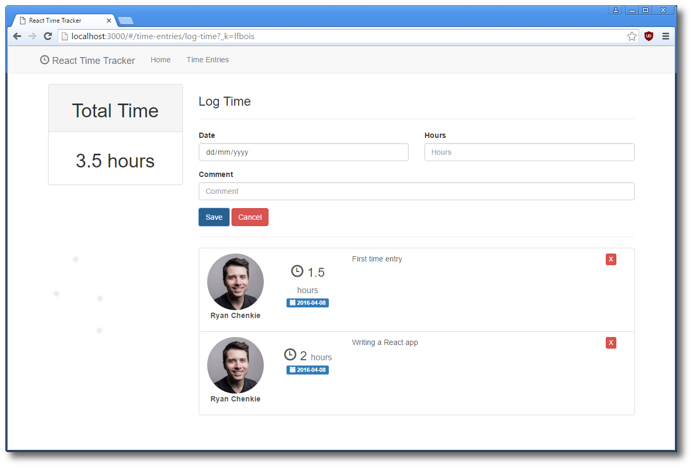

# React + Node Time Tracker

This repo is a clone of the [app from the Vue.js + Node time tracker tutorial](https://github.com/chenkie/vue-node-time-tracker) available at [Scotch.io](https://scotch.io), made with [React](https://facebook.github.io/react/) + [nwb](https://github.com/insin/nwb).



## Install and Run

```bash
cd client
npm install
npm start
```

**Note:** The server code isn't ready yet :)

The app will be served at `localhost:3000`.

## License

MIT
